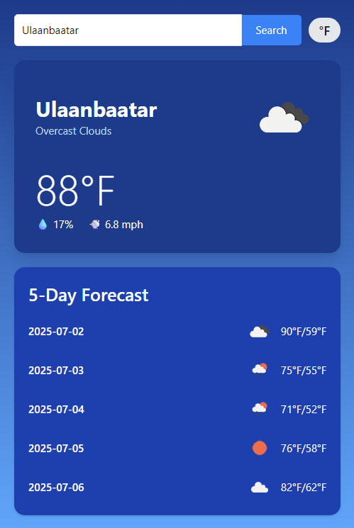

#Tugo's Weather App – Chrome Extension
A privacy-first, modern Chrome extension for current weather and 5-day forecasts worldwide.
Built with React, TypeScript, Vite, and Tailwind CSS.

>>>Published on Chrome Web Store - 'https://chromewebstore.google.com/detail/kelfigfhomnnebheemdoobjedlcbohfa?utm_source=item-share-cb'

##🚀 Features
-Current weather for any city (temperature, humidity, wind, condition)
-5-day forecast with daily summaries
-Location search for any city worldwide
-Temperature unit toggle (°C / °F)
-User privacy: No data collection or tracking—your OpenWeather API key is stored locally
-Modern UI: Responsive, minimal, and fast

##🛠️ Technologies Used
React.js – UI library for building user interfaces
TypeScript – Strongly-typed JavaScript for safer, scalable code
Vite – Fast build tool and development server
Tailwind CSS – Utility-first CSS framework for styling
Chrome Extensions API (Manifest V3) – For browser extension functionality
OpenWeather API – For fetching live weather and forecast data
ESLint – Code linting and style enforcement
PostCSS – CSS transformation and optimization
Git – Version control

#🛠️ Getting Started
##🟢 How to Get an OpenWeather API Key
-Go to the OpenWeather website: 'https://openweathermap.org/'
-Sign up for a free account (or log in if you already have one).
-After logging in, click your username in the top right and choose “My API keys” (or “API keys” in your dashboard).
-Click “Create Key” if you don’t have one yet.
-Name your key (e.g., "Tugo Weather App").
-Copy the generated API key.
-Paste your API key into the extension’s Options page after installing and loading the extension.

###1. Clone the repository

'git clone https://github.com/yourusername/weather-extension.git'
'cd weather-extension'

###2. Install dependencies

'npm install'

###3. Development build (for popup preview)

npm run dev
Open 'http://localhost:5173' to preview the popup in your browser.

###4. Build for Chrome Extension

'npm run build'
This will generate a dist/ folder with all extension files.

###5. Load the extension in Chrome

Open chrome://extensions (enable Developer mode)
Click Load unpacked
Select the dist/ folder

##🔑 How to Use
First time use:
-Click the extension icon. You’ll be prompted to enter your own OpenWeather API key in the Options page.

-Search any city to get current weather and forecast.

-Toggle between °C and °F as needed.

##🔒 Privacy
No personal data is collected, stored, or shared.

Your API key and preferences are only stored locally in your browser.

All weather data is fetched directly from OpenWeather.

##🖼️ Screenshots

##📦 Contributing
Pull requests and issues are welcome!

##📄 License
MIT

##🙋 Questions?
Open an issue or contact [tuguldur.js83@gmail.com or github.com/Tuguldurs526].